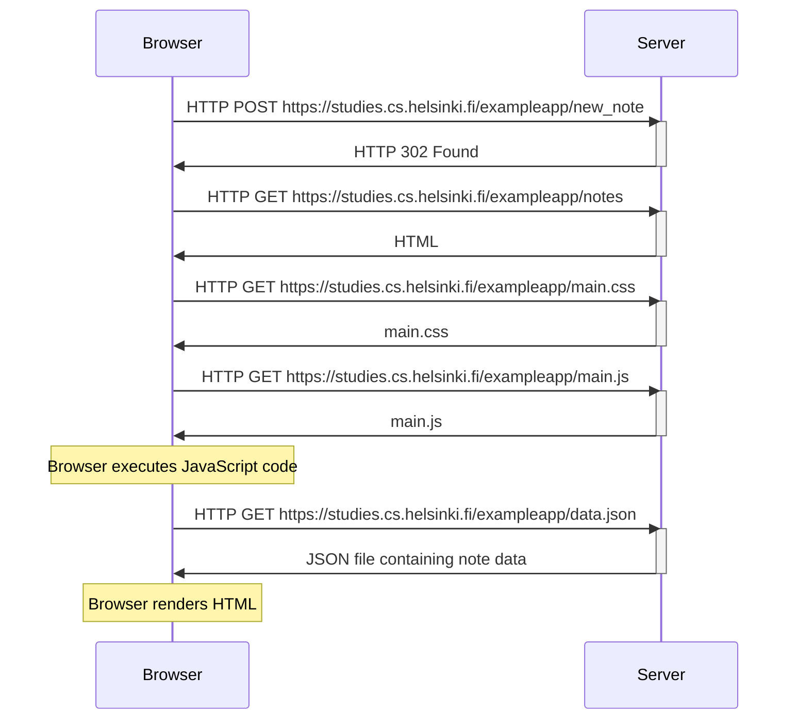

## New Note

```mermaid
sequenceDiagram
    participant Browser
    participant Server

    Browser->>Server: HTTP POST https://studies.cs.helsinki.fi/exampleapp/new_note
    activate Server
    Server->>Browser: HTTP 302 Found
    deactivate Server

    Browser->>Server: HTTP GET https://studies.cs.helsinki.fi/exampleapp/notes
    activate Server
    Server->>Browser: HTML
    deactivate Server

    Browser->>Server: HTTP GET https://studies.cs.helsinki.fi/exampleapp/main.css
    activate Server
    Server->>Browser: main.css
    deactivate Server

    Browser->>Server: HTTP GET https://studies.cs.helsinki.fi/exampleapp/main.js
    activate Server
    Server->>Browser: main.js
    deactivate Server

    Note over Browser: Browser executes JavaScript code

    Browser->>Server: HTTP GET https://studies.cs.helsinki.fi/exampleapp/data.json
    activate Server
    Server->>Browser: JSON file containing note data
    deactivate Server

    Note over Browser: Browser renders HTML 
```

