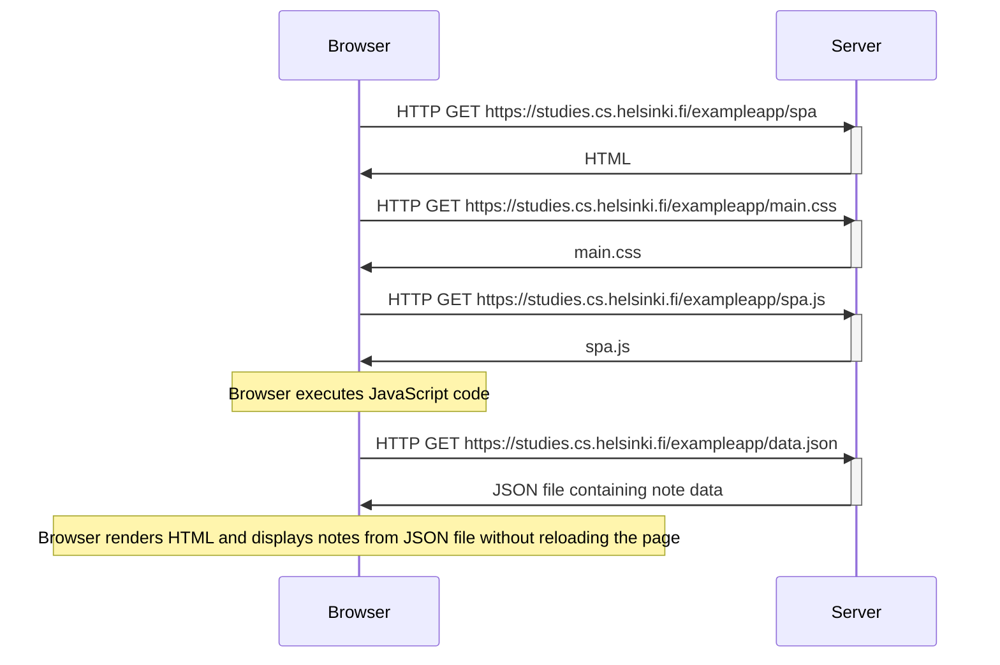

## Single page app

```mermaid
sequenceDiagram
    participant Browser
    participant Server

    Browser->>Server: HTTP GET https://studies.cs.helsinki.fi/exampleapp/spa
    activate Server
    Server->>Browser: HTML
    deactivate Server

    Browser->>Server: HTTP GET https://studies.cs.helsinki.fi/exampleapp/main.css
    activate Server
    Server->>Browser: main.css
    deactivate Server

    Browser->>Server: HTTP GET https://studies.cs.helsinki.fi/exampleapp/spa.js
    activate Server
    Server->>Browser: spa.js
    deactivate Server

    Note over Browser: Browser executes JavaScript code

    Browser->>Server: HTTP GET https://studies.cs.helsinki.fi/exampleapp/data.json
    activate Server
    Server->>Browser: JSON file containing note data
    deactivate Server

    Note over Browser: Browser renders HTML and displays notes from JSON file without reloading the page


```